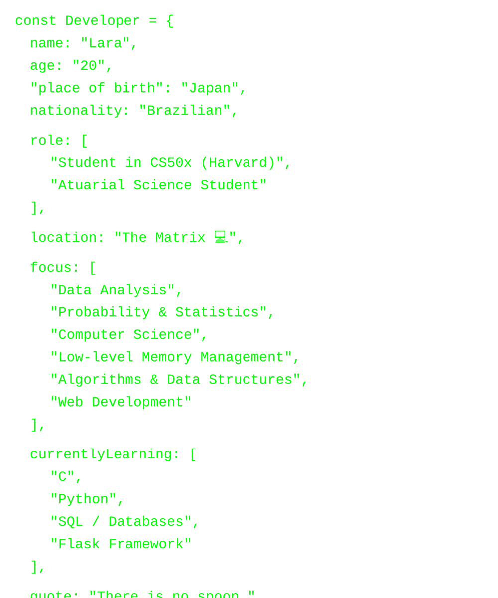

  

 

  

 

 

<svg xmlns="http://www.w3.org/2000/svg" viewBox="0 0 800 200" width="100%" height="100%">
  

  <!-- Pílula Vermelha -->
  <g transform="translate(100, 70)">
    <rect x="0" y="0" width="70" height="30" rx="15" class="pill-red pill-anim l1" />
    <text x="90" y="24" class="pill-text text-red">> Red Pill</text>
  </g>

  <!-- Pílula Azul -->
  <g transform="translate(450, 70)">
    <rect x="0" y="0" width="70" height="30" rx="15" class="pill-blue pill-anim line2" />
    <text x="90" y="24" class="pill-text text-blue line2">> Blue Pill</text>
  </g>
</svg>

 

 

  

 

 

  

